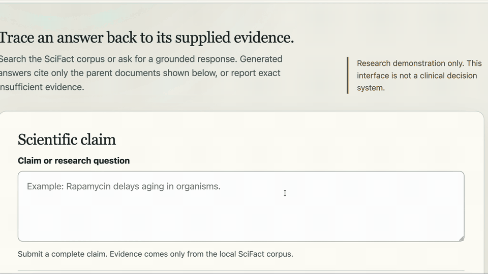

# SciFact RAG

An inspectable scientific retrieval-augmented generation system built for one NVIDIA DGX Spark.
It retrieves evidence from 5,183 biomedical abstracts, ranks it with lexical, dense, coreference,
and late-interaction methods, then asks a locally hosted Qwen model for a cited answer or an
explicit `insufficient evidence` result.

This project is deliberately more than a plausible RAG demo: retrieval and generation decisions
are measured, failure cases remain visible, evaluation component revisions are recorded, selected
images and checkpoints are pinned, and experimental strategies stay modular rather than
accumulating in the production score.

**Status: completed DGX-local prototype with an accepted, opt-in public-demo application
boundary.** CLI, HTTP, MCP, and web interfaces are accepted.
The [roadmap](docs/project/roadmap.md) records completed and stopped experiments. Template/Pi
evaluation now belongs to [agentic-project-template #59](https://github.com/stauntonjr/agentic-project-template/issues/59);
further scientific research or production-service work requires a new scope decision.

## At A Glance


**Who and why:** researchers and developers need to inspect both the answer and
the evidence supplied to the model. The system retains parent-document identity,
matching passages, retrieval signals, and generation context so relevance and
scientific fidelity can be examined separately.

**How:** ingest public SciFact abstracts into PostgreSQL, retrieve and deduplicate
candidates across six channels, rerank their bounded content views with ColBERT,
assemble context, and request a locally generated answer. Search ends at ranked
evidence; answering adds generation and a parent-document citation check.

**Current boundary:** this is a measured single-DGX prototype. Whole-document
generation context is the default; adaptive context and the fast BM25 hybrid are
explicit alternatives. Citation validation checks document identity, while
scientific support, contradiction, and overstatement require separate evaluation.
Experimental inference and proposition/graph work are outside the default path.

## Measured result

The selected retrieval architecture builds a broad six-channel candidate pool and ranks each
document by its best ColBERT score across bounded, coreference-informed content chunks.

| Retrieval strategy | nDCG@10 | Recall@10 | MRR@10 | Median latency |
|---|---:|---:|---:|---:|
| DP content-max ColBERT — selected default | **0.742493** | **0.806250** | **0.728472** | 638.94 ms |
| Whole-document ColBERT | 0.734958 | 0.800000 | 0.722569 | 642.45 ms |
| BM25 + token-window RRF | 0.673519 | 0.787500 | 0.647436 | **78.70 ms** |

These are internal comparative results over a fixed 160-query SciFact validation partition that
had already been inspected. They support an engineering choice, not an unbiased generalization
claim. The selected default improves nDCG by 0.068975 over the BM25 hybrid while accepting an
approximately 8.1x median-latency cost and a ColBERT GPU-service dependency. BM25 remains the
supported fast/no-ColBERT alternative.

## What the project demonstrates

- A clean application core built from frozen Python dataclasses and replaceable ports, with thin
  Typer CLI, FastAPI HTTP, official-SDK MCP, and browser presentation adapters.
- PostgreSQL 17 with pgvector and VectorChord-BM25 as one inspectable evidence store rather than a
  collection of hidden managed services.
- Dedicated candidate generation, feature-preserving pooling, complete reranking, and parent-level
  citation provenance.
- Coreference-aware dynamic-programming chunk boundaries that scale beyond short abstracts while
  preserving exact source text.
- Locally hosted MiniLM, ColBERT, and Qwen inference on a single DGX Spark through Docker Compose
  and OpenAI-compatible model serving.
- Reproducible evaluations with frozen manifests, raw per-query rows, resumability, artifact
  digests, query-level transitions, and explicit evidence limitations.
- Negative results retained as design evidence: title/content score fusion and robust normalization
  were not promoted after controlled ablations regressed ranking quality.

## Architecture

1. **Prepare evidence:** preserve the original title, abstract, and document ID;
   build title, token-window, and coreference-informed representations; embed
   searchable views with MiniLM. PostgreSQL stores the parents, source-preserving
   chunks, and indexes through pgvector and VectorChord-BM25.
2. **Retrieve and rank:** BM25, title, token-window, proper-noun coreference,
   nominal coreference, and packed coreference-interval channels contribute to
   one deduplicated parent-document pool. The selected strategy scores every
   pooled parent using its best ColBERT MaxSim score over bounded, dynamic-programming
   (DP) content views. It retains channel signals and the matching passage;
   title-score fusion and graph scoring are not part of this default.
3. **Assemble context and answer:** the default supplies whole retrieved abstracts.
   The opt-in adaptive policy retains a whole abstract when its stored DP view
   exactly matches it; otherwise it selects up to two ranked views per parent,
   restoring source order. Qwen receives the question and this evidence through
   an OpenAI-compatible endpoint. The application accepts citations only to
   retrieved parent IDs and returns `insufficient evidence` for empty retrieval,
   an explicit model abstention, or missing/invalid citations. Service failures
   remain errors. A valid citation does not establish that every claim is supported.

**Validation is a separate lane.** Retrieval comparisons use SciFact relevance
labels, per-query rankings, quality metrics, and latency. Generation evaluation
examines support, contradiction, insufficiency, qualifiers, and material
overstatement against supplied evidence. Frozen manifests, component revisions,
and artifact digests keep results attributable. The inspected retrieval partition
and short-abstract generation review retain the limitations described above;
they do not establish fresh generalization or long-document performance.

See the [selected retrieval decision](docs/adr/0029-retrieval-default-selection.md),
[context-assembly decision](docs/adr/0028-generation-context-assembly.md), and
[technical reference](docs/project/technical-reference.md) for strategy, storage,
provenance, and evaluation details. The [roadmap](docs/project/roadmap.md) records
experimental and stopped work separately from the selected request path.

The pipeline is a modular monolith with one explicit composition root. LangGraph is intentionally
absent: the current request path is deterministic and does not need a stateful agent workflow.
The CLI, loopback HTTP API, loopback MCP service, and small evidence-inspection page share the same
application services. The browser calls the existing HTTP contracts rather than implementing a
second retrieval or generation path.

## Live UI showcase

[](https://stauntonjr.github.io/scifact-rag/showcase/scifact-ui/)

[Watch the full recording with captions](https://stauntonjr.github.io/scifact-rag/showcase/scifact-ui/).
It captures the actual loopback application and local model services. The recording is the durable
showcase and remains usable when the optional live demo is offline. The page checks the best-effort
live path once, enables **Open live demo** only after a successful readiness response, and otherwise
keeps the recording and an honest offline message. The short GIF condenses waiting and scrolling
from the disclosed longer edit.

## Try it

Requirements are Docker Compose, access to an NVIDIA DGX Spark, and the required model assets. The
ColBERT service is required by the selected retrieval default; `ask` also expects the configured
Qwen OpenAI-compatible endpoint.

```bash
docker compose up -d postgres late-interaction
docker compose build app
docker compose run --rm app download
docker compose run --rm app ingest
docker compose run --rm app search \
  "What evidence links immune signaling to disease?"
docker compose run --rm app ask \
  "What evidence links immune signaling to disease?"
```

Start the local HTTP adapter over the same application layer:

```bash
docker compose up -d api
curl http://127.0.0.1:8090/healthz
curl -X POST http://127.0.0.1:8090/v1/search \
  -H 'content-type: application/json' \
  -d '{"schema_version":"search-request/v1","query":"immune signaling","limit":5}'
```

The default API remains a loopback-only prototype. Issue #27 adds an opt-in, anonymous,
best-effort live-demo mode for the same single-worker service; it is not a supported third-party
API and has no uptime promise. Complete request, response, error, readiness, capability, and
operator details are in the [technical reference](docs/project/technical-reference.md#http-api).

The same API service hosts the evidence inspector:

```bash
docker compose up -d --build api
# Open http://127.0.0.1:8090/
```

It shows the active strategies, answer status, citations, ordered parent-document evidence,
document IDs, scores, matching passages, and the complete text supplied to generation. It is a
local inspection surface without authentication, TLS, public ingress, or independent retrieval
logic.

Start the DGX-local MCP service over the same application layer:

```bash
docker compose up -d mcp
```

It publishes only `http://127.0.0.1:8091/mcp` and exposes exactly `search_scifact` and
`answer_scifact`. Complete tool, result, validation, and client details are in the
[technical reference](docs/project/technical-reference.md#mcp-service).

Use the fast fallback explicitly when ColBERT is unavailable:

```bash
docker compose run --rm app search \
  --strategy bm25-token-window-rrf \
  "What evidence links immune signaling to disease?"
```

## Current status

- Retrieval default: `pooled-coref-interval-content-max-colbert`.
- Retrieval fallback: `bm25-token-window-rrf`.
- Generation-context default: `whole-document`; `adaptive` is the scalable opt-in policy.
- CLI, loopback HTTP, DGX-local loopback MCP, and the small evidence-inspection web UI are accepted.
  Graph scoring and agent-development evaluation remain downstream.
- The fixed blinded generation review is complete: all three recorded policy names scored 18/24
  grounded answers, which is expected on short abstracts and does not test long-document scaling.
- The CLI release gate is accepted: a clean public branch builds, isolated empty/no-op ingests
  preserve all 5,183 documents and BM25 invariants, and the retained live sample verifies support,
  contradiction, scientific qualification, exact insufficiency, and parent-only citations.
- The loopback HTTP adapter passed full engineering, integration, supported-answer,
  exact-insufficiency, and parent-citation acceptance. The MCP adapter passed the full engineering
  and affected integration gates plus official-client discovery, supported-answer,
  exact-insufficiency, parent-citation, and invalid-input acceptance.

## Documentation

- [Technical and operator reference](docs/project/technical-reference.md): all retrieval
  strategies, commands, schemas, provenance, model revisions, and operational details formerly in
  this README.
- [Roadmap](docs/project/roadmap.md): ordered product phases, gates, and deferrals.
- [Architecture decisions](docs/adr/): durable design choices and measured dispositions.
- [Retrieval leaderboard](docs/reports/scifact-retrieval-leaderboard.md): historical and fixed
  comparisons with evidence boundaries.
- [Issue #6 validation report](docs/reports/issue-6-retrieval-default-validation.md): raw artifact
  hashes, component revisions, metrics, and query-level transitions behind the selected default.
- [Issue #10 CLI acceptance](docs/reports/issue-10-cli-acceptance.md): clean-build, transactional
  ingest, live generation, citation, latency, provenance, limitation, and failure evidence.
- [Issue #11 HTTP acceptance](docs/reports/issue-11-http-api-acceptance.md): schema, parity,
  loopback, integration, supported-answer, insufficiency, and parent-citation evidence.
- [Issue #12 MCP acceptance](docs/reports/issue-12-mcp-acceptance.md): official-client discovery,
  strict validation, parity, loopback topology, integration, citation, and insufficiency evidence.
- [Issue #13 web UI acceptance](docs/reports/issue-13-web-ui-acceptance.md): packaged-resource,
  browser-state, citation, insufficiency, failure, restoration, and local-only evidence.
- [Project handoff](docs/project/handoff.md): current implementation and operating state.

## Development

```bash
make smoke
```

The gate checks the harness contract, formatting, linting, static types, unit tests, package
build/install, and Docker Compose configuration. Integration and live-model evaluations remain
separate because they exercise retained data and GPU services.

## License

Application code is MIT licensed. Dataset, model, container, PostgreSQL extension, and other
third-party components retain their own licenses; see the
[technical reference](docs/project/technical-reference.md) and [LICENSE](LICENSE).
